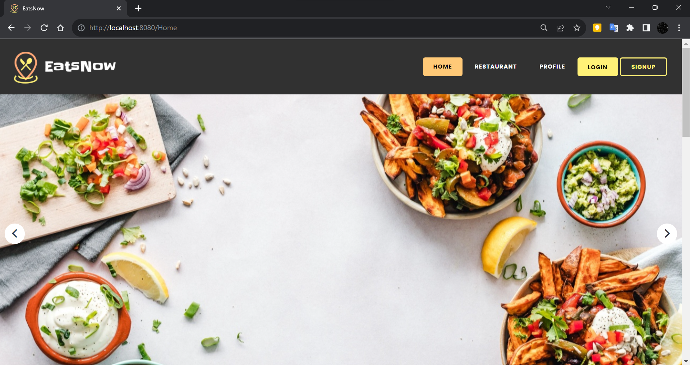
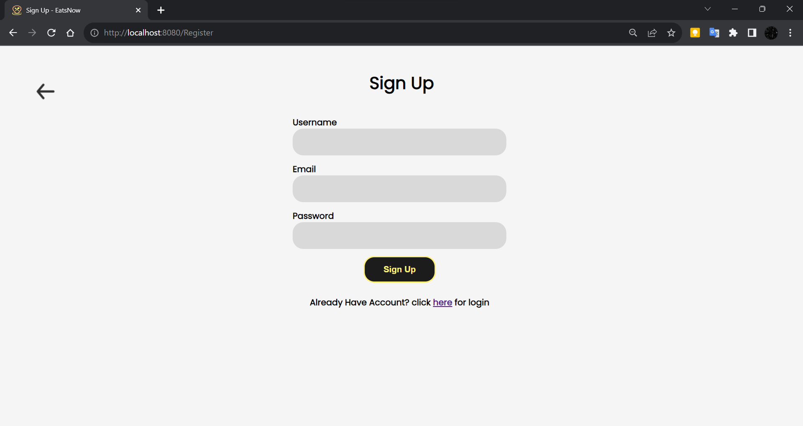
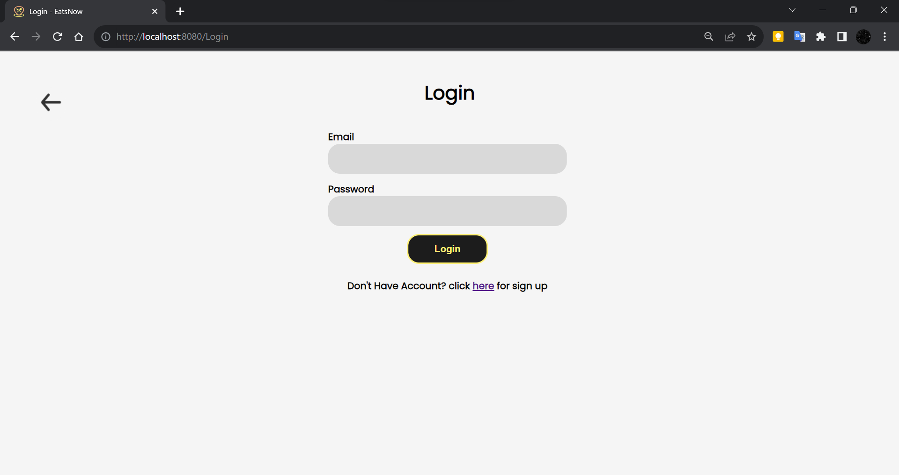
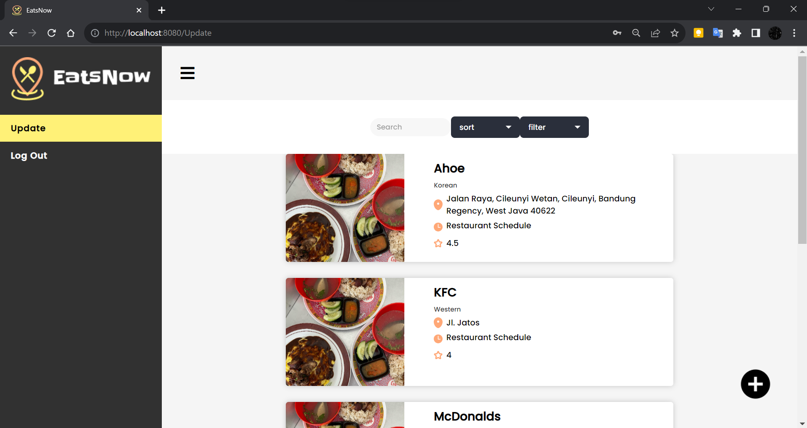
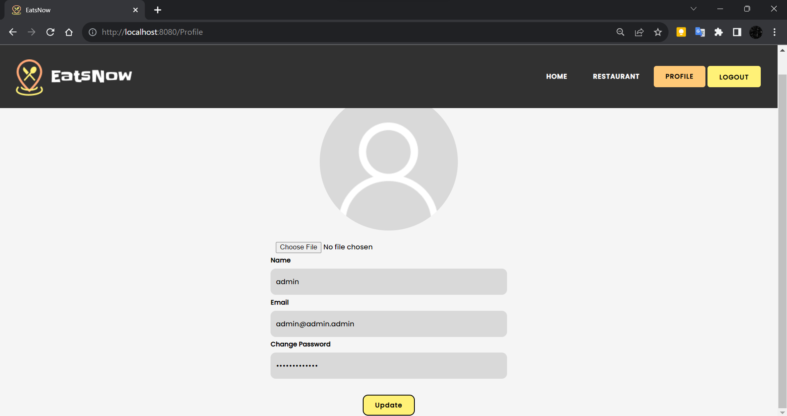
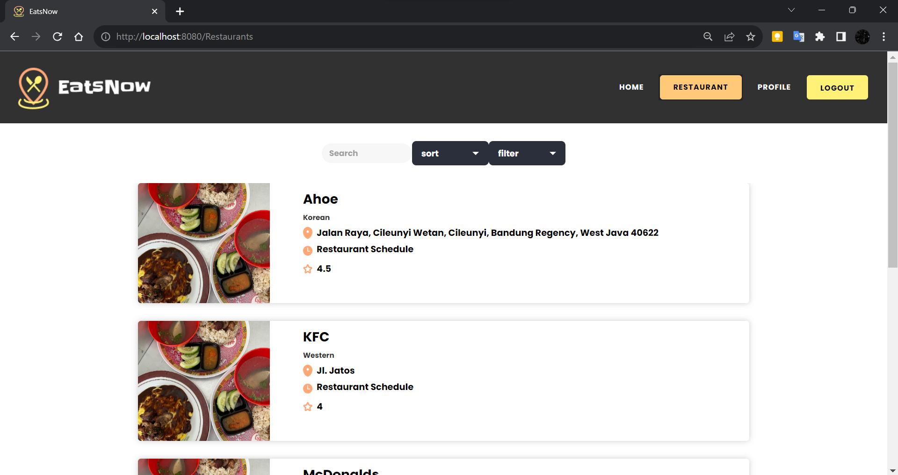
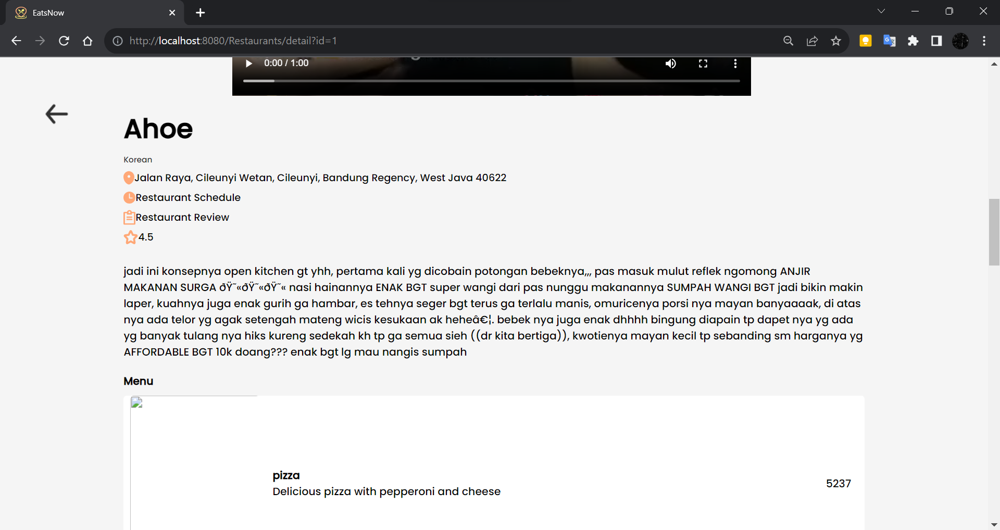
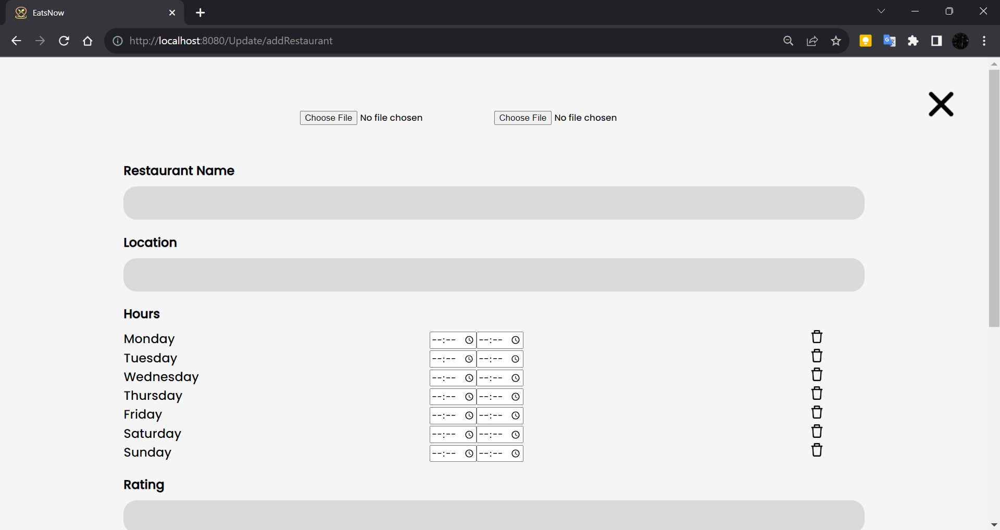
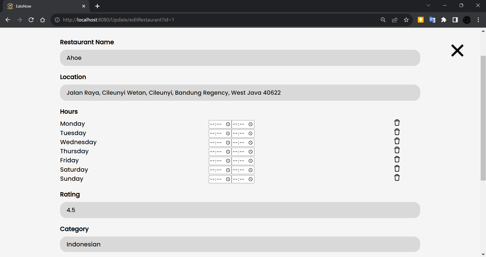

# EatsNow
Disusun untuk memenuhi tugas besar 1 mata kuliah IF3110 Pengembangan Aplikasi Berbasis Web
## Table of Contents
* [Description](#description)
* [Requirements](#requirements)
* [How To Run Server](#how-to-run-server)
* [Screenshots](#screenshots)
* [Authors](#authors)

## Description
EatsNow merupakan suatu aplikasi berbasis web sederhana yang dirancang untuk memudahkan pengguna dalam mencari rekomendasi makanan di Jatinangor. EatsNow menghadirkan beragam pilihan kuliner dari restoran dan warung makan yang ada di Jatinangor. 

EatsNow dibangun menggunakan bahasa pemrograman PHP, HTML, CSS, dan JavaScript tanpa framework. EatsNow juga menggunakan database MySQL untuk menyimpan data-data yang diperlukan. 

Daftar fitur: 
   * Register
   * Login
   * Homepage
   * List Restaurant
   * Food Menu
   * User Profile
   * Update Restaurant Information for Admin
   * Add Restaurant for Admin

## Update v2.0
- Admin mampu untuk __mengedit__ jumlah voucher
- Pengguna mampu untuk __melihat review__ dari user premium
- Pengguna mampu untuk berlangganan dan langsung mendapatkan akun ke aplikasi EatsNow Premium

## Requirements
[Docker Desktop](https://www.docker.com/products/docker-desktop/)

## How To Run Server
1. Buka Docker Desktop
2. pada terminal folder ini, jalankan perintah `docker-compose build`
3. Setelah perintah selesai dijalankan, jalankan perintah `docker-compose up`
4. Buka browser, kemudian entri url `localhost:8080`

## Screenshots
1. Halaman Utama 
    ---
    
2. Halaman Sign Up 
    ---
    
3. Halaman Login 
    ---
    
4. Halaman Homepage Admin 
    ---
    
5. Halaman Profile 
    ---
    
6. Halaman Restaurants 
    ---
    
7. Halaman Restaurant Information 
    ---
    
8. Halaman Add New Restaurant 
    ---
    
9. Halaman Update Restaurant 
    ---
    

## Authors
1. Server-side
Login : 13521027
Sign Up : 13521027
Homepage User : 13521018
Homepage Admin : 13521018, 13521027
List Restaurant : 13521018, 13521023, 13521027
Restaurant Information : 13521018, 13521023, 13521027
Add New Restaurant : 13521018, 13521023
Update Restaurant : 13521018, 13521023
Update Profile : 13521028
Docker Setup : 13521023, 13521027
Routing Path : 13521023

2. Client-side
Login : 13521027
Sign Up : 13521027
Homepage User : 13521018
List Restaurant : 13521023
Restaurant Information : 13521023
Add New Restaurant : 13521018
Update Restaurant : 13521018
Update Profile : 13521018
